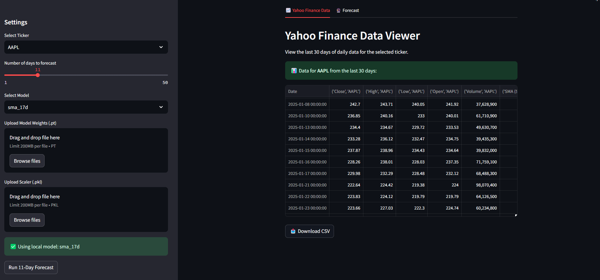
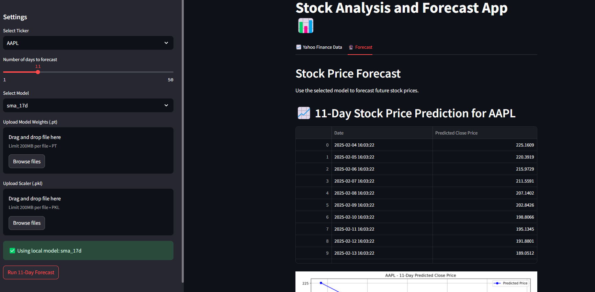

# 📌 Stock Market Prediction & Trading

## 🚀 Installation & Setup

### **1️⃣ Clone the Repository**
```bash
git clone git@github.com:Yavuzhan-Baykara/Machine-Learning-Engineer-Position-Assignment-Done.git
cd Machine-Learning-Engineer-Position-Assignment-Done
```

### **2️⃣ Setup the Environment**
If using **pip**, install dependencies using:
```bash
pip install -r requirements.txt
```

If using **conda**, create a virtual environment and install dependencies:
```bash
conda env create -f environment.yml
conda activate my_project
```

### **3️⃣ Run the Streamlit App**
```bash
streamlit run app.py
```

## 📊 Model & Methodology
- The model uses **LSTM (Long Short-Term Memory) networks** for time-series forecasting.
- Data is normalized using **MinMaxScaler**.
- The sequence length is **11**, and predictions are dynamically updated using past values.
- **Streamlit** is used for visualization.

### Training & Feature Selection
- Initially, **SMA (Simple Moving Average) values were tested in combination with RCI (Rank Correlation Index) values**.
- After evaluation, **open_val, high_val, low_val, and sma_17** were determined to be the most effective features for the model.
- Since this is a **multi-input, one-output model**, it did not result in a high-dimensional deep neural network.
- Data visualization was performed, and companies were selected based on **normal distribution analysis and risk scores**.
- The **EDA notebook** can be accessed at `docs/yahoo-finance-eda.ipynb`. 
- **Framework:** PyTorch
- **Features Used:** Open, High, Low, SMA
- **Sequence Length:** 11 days
- **Forecast Horizon:** Variable (user-defined)

## 🛠️ Usage
- Train the model using `docs/stock-market-feature-extraction-TRAIN.ipynb`
- Use `app.py` to visualize forecasts in a Streamlit web application
### 1️⃣ Yahoo Finance Data Viewer
Users can view the last 30 days of stock data for the selected ticker.



### 2️⃣ Stock Price Forecast
The trained model predicts future stock prices based on historical data.


## 📌 Author
[Yavuzhan Baykara](https://github.com/Yavuzhan-Baykara) 🚀

---

Feel free to contribute and improve the project! If you encounter any issues, please open an issue or pull request. 😊

