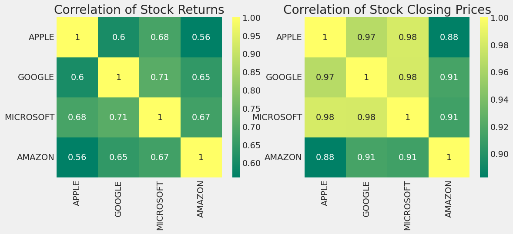
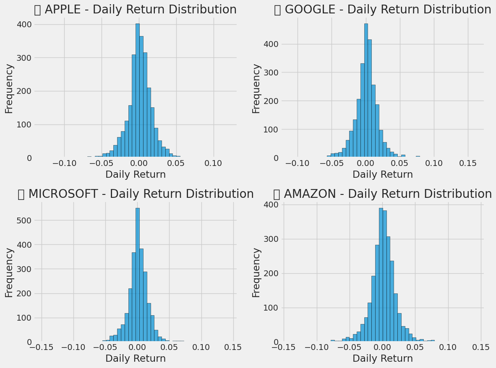
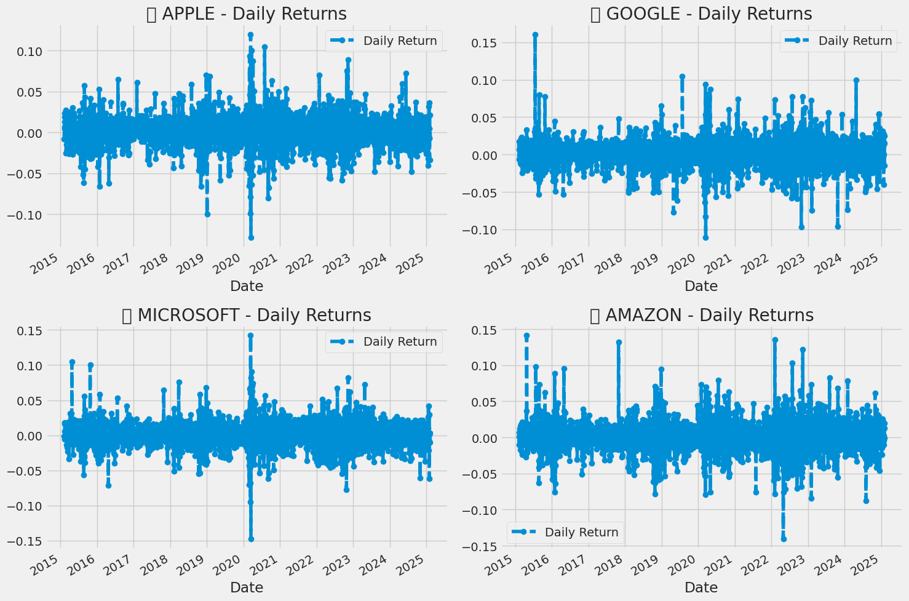
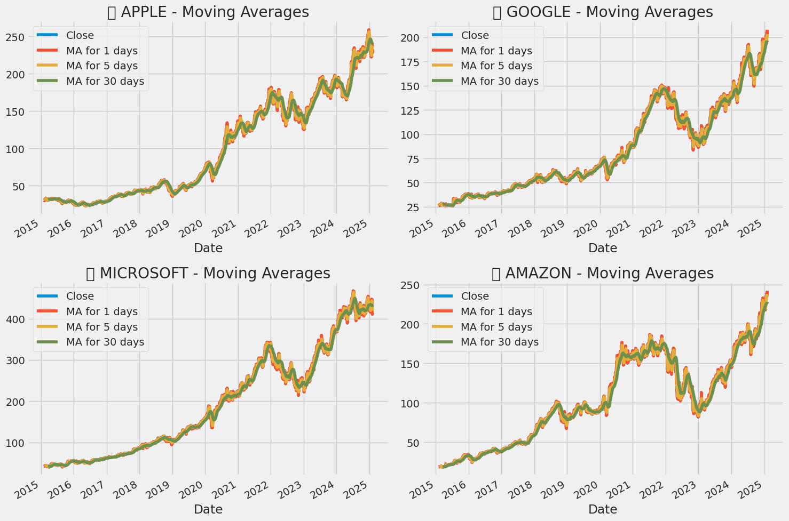
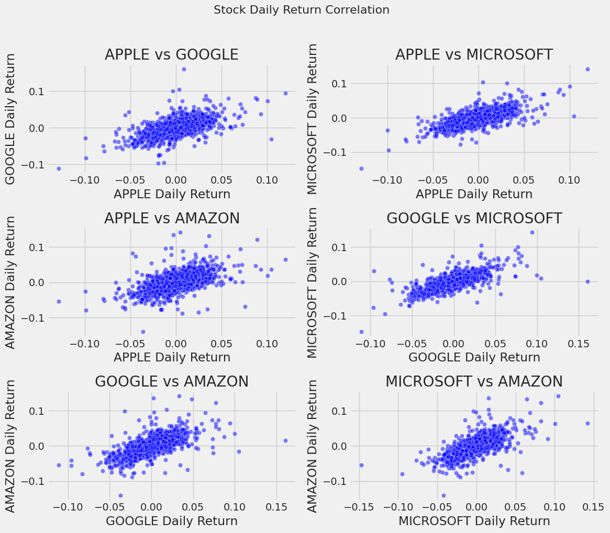
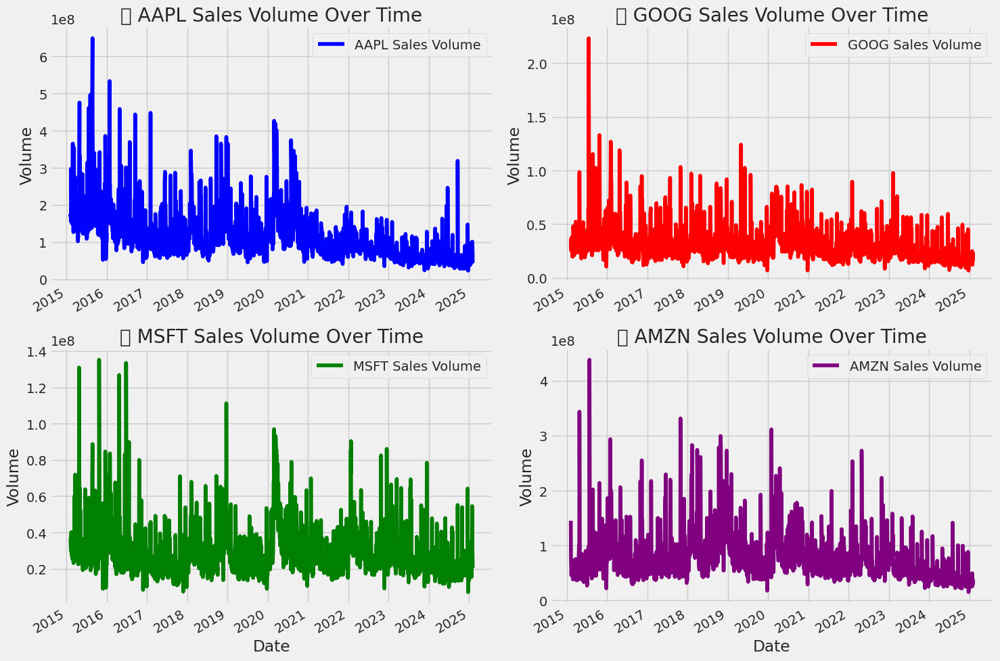
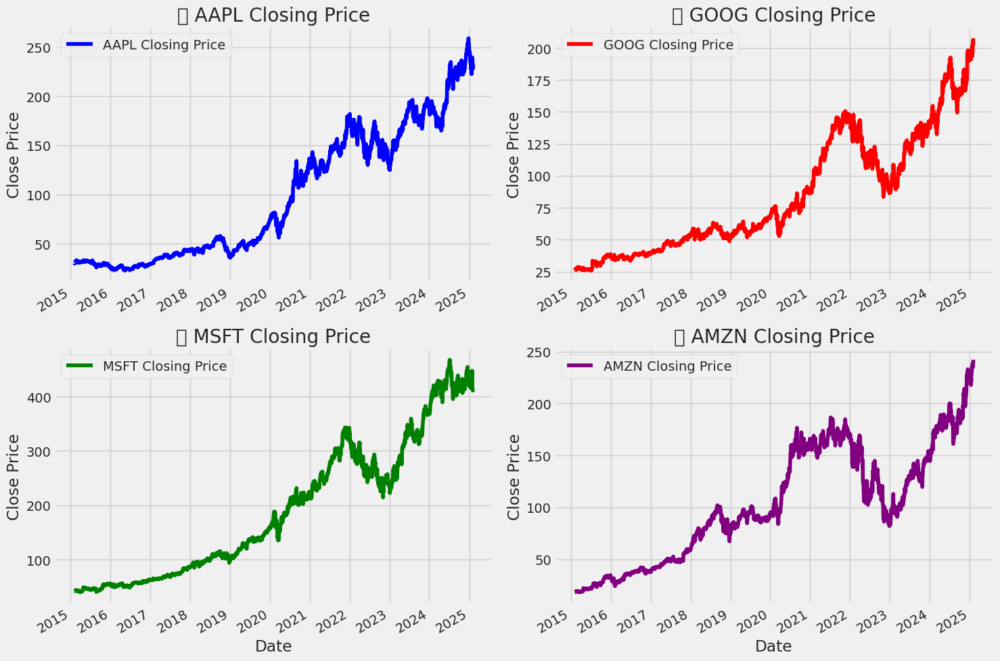
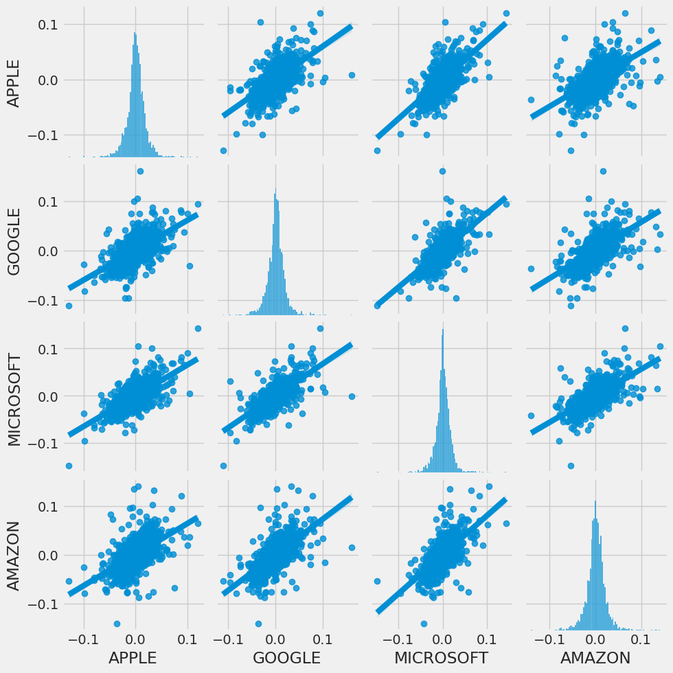
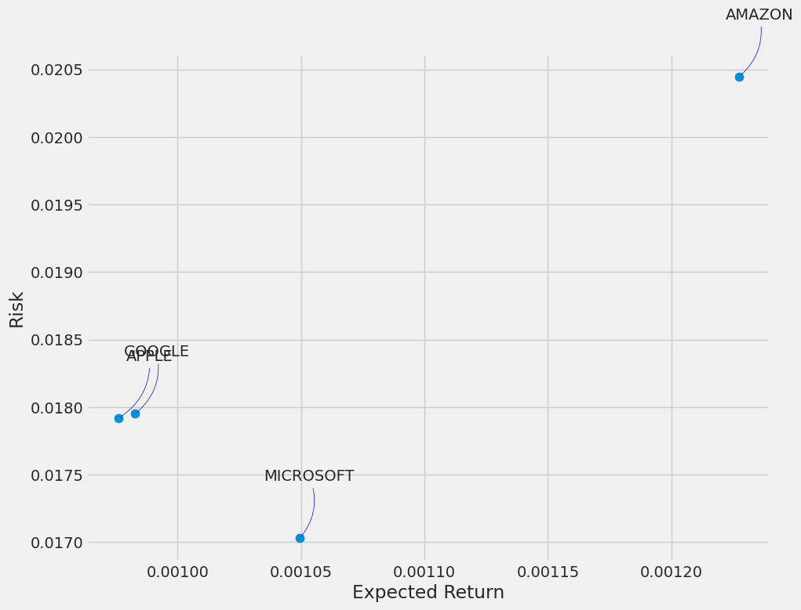

## **Stock Market Data Analysis**  

A detailed analysis of various stock market indicators, including correlations, return distributions, daily fluctuations, moving averages, and trading volumes. Each visualization offers insights into the performance and relationships among major tech stocks: **Apple, Google, Microsoft, and Amazon**.  

---

### **1. Correlation of Stock Returns and Closing Prices**  
📌

This heatmap compares the correlation of **stock returns** and **closing prices** among the selected companies.  

- Stock **returns** show a moderate correlation (0.56-0.71), suggesting independent price movements.  
- **Closing prices** have a stronger correlation (above 0.9), indicating that stock prices of these companies tend to move together over time.  
- **Microsoft and Google** exhibit the highest correlation, reflecting similar price trends.  

---

### **2. Daily Return Distributions**  
📌

This visualization displays histograms of daily returns for each stock.  

- All stocks exhibit **near-normal return distributions**, centered around zero.  
- **Amazon** has a slightly wider spread, indicating higher volatility.  
- **Microsoft and Apple** have more compact distributions, suggesting more stable returns.  

---

### **3. Daily Return Time Series**  
📌

The daily return plots illustrate stock price fluctuations over time.  

- **Periods of high volatility**, especially during financial crises, are visible.  
- **Microsoft and Google** tend to exhibit more stable movements, while **Amazon** experiences **larger spikes** in return changes.  
- Extreme return fluctuations indicate market reactions to external factors such as earnings reports or economic events.  

---

### **4. Moving Averages**  
📌

Moving averages help smooth out short-term price fluctuations and reveal overall trends.  

- **Short-term (1-day) averages** are more sensitive, reacting quickly to price changes.  
- **Longer-term (30-day) averages** provide a clearer trend and reduce noise.  
- All stocks exhibit a **general upward trend**, with some fluctuations during market corrections.  

---

### **5. Stock Daily Return Correlations**  
📌

Scatter plots display the relationships between the daily returns of different stock pairs.  

- **Microsoft and Google** have a strong linear relationship, confirming **high correlation**.  
- **Amazon and Apple** exhibit more dispersed points, indicating **weaker correlation** and independent price movements.  
- Stocks with **stronger linear relationships** tend to move together in response to market conditions.  

---

### **6. Sales Volume Over Time**  
📌

This plot represents stock trading volumes across time.  

- **Apple and Microsoft** show **high trading volumes**, indicating strong investor interest.  
- **Amazon has highly volatile trading volume**, reflecting market uncertainty and increased speculative trading.  
- Overall, **trading activity has declined over time**, possibly due to shifts in market sentiment or changes in institutional holdings.  

---

### **7. Stock Closing Prices Over Time**  
📌

The stock price movements over the years show **long-term trends**.  

- **Microsoft and Apple** have experienced **consistent growth**, making them attractive for long-term investors.  
- **Amazon and Google** show **higher price fluctuations**, often influenced by external factors.  
- **All stocks exhibit an upward trajectory**, indicating **overall market growth and investor confidence**.  

---
### **8. Pair Plot Analysis**  
📌

This visualization provides a **pairwise comparison of stock returns**, illustrating correlations between different stocks.  

- The **upper triangle** consists of scatter plots, highlighting return correlations.  
- The **lower triangle** shows KDE (Kernel Density Estimation) plots, revealing return distributions.  
- The **diagonal histograms** present individual stock return distributions, showing variation in volatility.  

---

### **9. Risk vs. Expected Return**  
📌

This plot visualizes the **risk-return profile** of major stocks.  

- **Amazon has the highest risk and return**, making it a high-reward, high-risk investment.  
- **Microsoft shows the lowest risk**, making it a stable investment choice.  
- **Google and Apple have similar risk-return characteristics**, suggesting similar investment profiles.  

---

### **Final Insights**  

- **Microsoft and Google** are highly correlated, making them **less effective for diversification**.  
- **Amazon experiences higher volatility**, presenting **both risk and opportunity** for traders.  
- **All stocks show long-term growth**, indicating their resilience and potential for continued appreciation.  