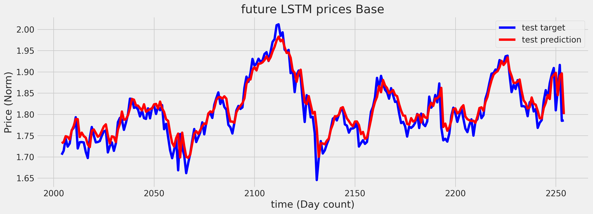

# Model Training and Feature Extraction

## Initial Training Results

The initial training results for the basic model are as follows:

```
Train Loss: 0.11283 | Val Loss: 0.01498
Train Loss: 0.12802 | Val Loss: 0.01668
Train Loss: 0.15956 | Val Loss: 0.01887
Train Loss: 0.21902 | Val Loss: 0.01985
Train Loss: 0.30122 | Val Loss: 0.01841
...
Train Loss: 0.06630 | Val Loss: 0.00064
Train Loss: 0.06414 | Val Loss: 0.00062
```

Since this is a simple model, it originally contained all forward-looking feature extractions, allowing long-term predictions. However, due to excessive chaos and a lack of variety, the model was later adjusted to focus on a single output.

Additionally, no feature extraction was performed in the initial training phase.

## Second Training Phase

After the initial training, feature extraction was applied using the following indicators:

- 5-day Simple Moving Average (5d_SMA)
- 9-day Simple Moving Average (9d_SMA)
- 17-day Simple Moving Average (17d_SMA)
- 12-day Exponential Moving Average (12d_EMA)
- 26-day Exponential Moving Average (26d_EMA)
- Moving Average Convergence Divergence (MACD)
- MACD Signal Line (MACD_Signal)

Among these features, the **17-day SMA (17d_SMA)** provided the best session stability based on **R² and MAE metrics** when tested on validation data.

### 17d_SMA Validation Results

```
sma_17d - Epoch 97: Train Loss: 0.02291 | Val Loss: 0.00031
sma_17d - Epoch 98: Train Loss: 0.02308 | Val Loss: 0.00031
sma_17d - Epoch 99: Train Loss: 0.02324 | Val Loss: 0.00031
sma_17d - Epoch 100: Train Loss: 0.02337 | Val Loss: 0.00031
```
### Test Result



---